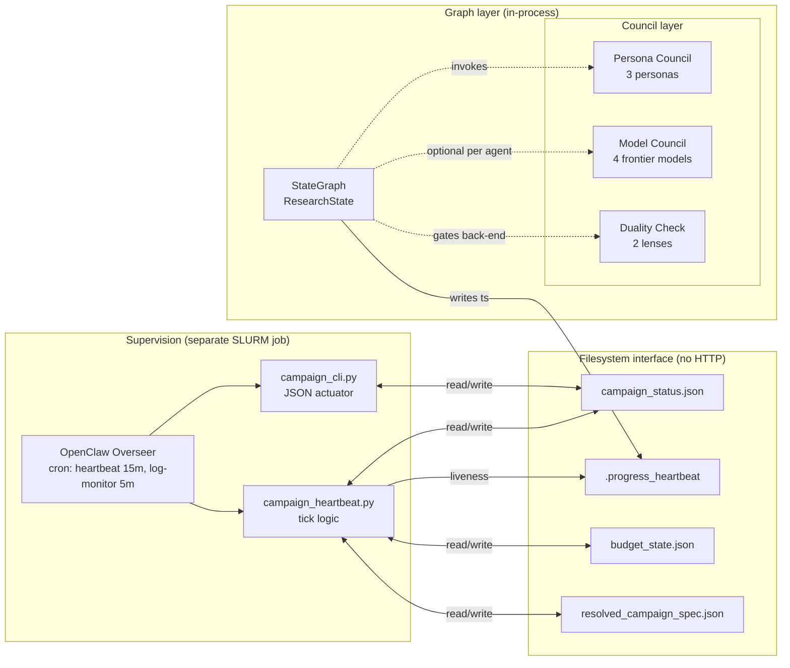
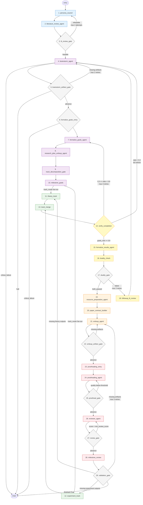
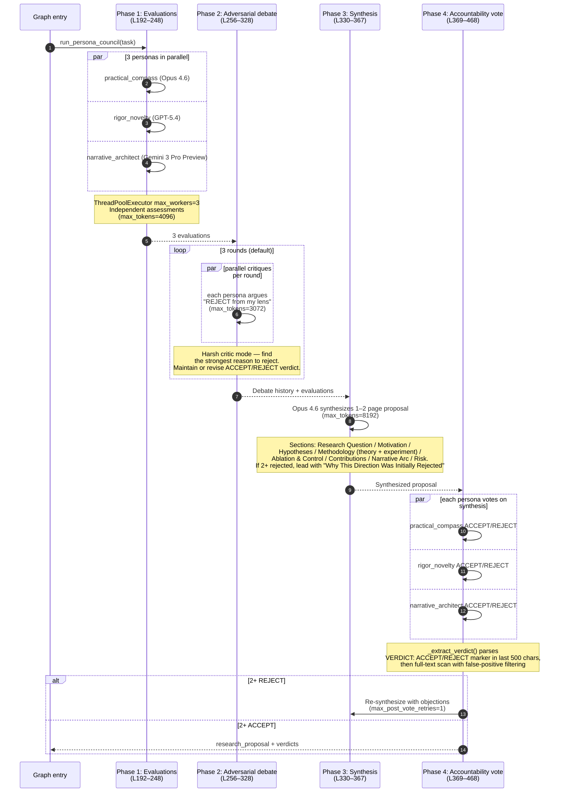
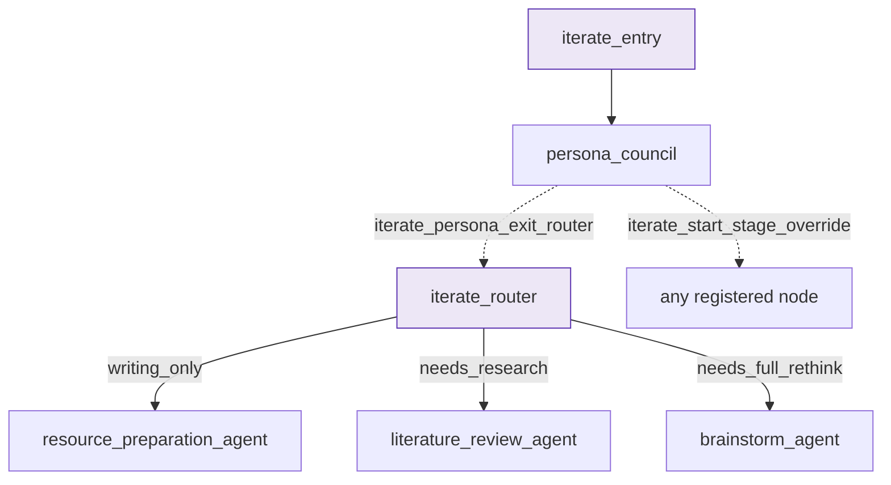

# MSc_Internal Backend — Architecture Guide

A reference for the V2 persona-council-driven research pipeline at [MSc_Internal/consortium/](MSc_Internal/consortium/). This guide maps the LangGraph state machine, the two council subsystems that gate it, and the OpenClaw overseer that supervises it from outside.

## Audience

- Contributors extending the pipeline graph (adding/reordering nodes, new gates).
- Operators debugging stuck or rejected campaigns.
- Anyone trying to understand why a council voted ACCEPT/REJECT or where a stage's artifacts are written.

Entry path through the code:

`launch_multiagent.py` → [`consortium/runner.py`](MSc_Internal/consortium/runner.py) → [`consortium/graph.py::build_research_graph_v2()`](MSc_Internal/consortium/graph.py#L2394)

For high-level project context (model defaults, environment, repo layout) see the project memory in `MEMORY.md`. This guide does not duplicate that material.

---

## Table of Contents

1. [System Overview](#1-system-overview)
2. [The LangGraph Pipeline](#2-the-langgraph-pipeline)
   - 2.1 [State Schema](#21-state-schema)
   - 2.2 [Pipeline Flowchart](#22-pipeline-flowchart)
   - 2.3 [Master Node Table](#23-master-node-table)
   - 2.4 [Conditional Routers](#24-conditional-routers)
   - 2.5 [Runtime Execution Mechanics](#25-runtime-execution-mechanics)
3. [Model Councils](#3-model-councils)
4. [Persona Councils](#4-persona-councils)
5. [OpenClaw Overseer](#5-openclaw-overseer)
6. [Iterate Mode](#6-iterate-mode)
7. [Configuration Reference](#7-configuration-reference)
8. [Where to Look When Something Goes Wrong](#8-where-to-look-when-something-goes-wrong)
9. [Appendix: Prompt File Index](#9-appendix-prompt-file-index)

---

## 1. System Overview

MSc_Internal has three layers that interact through well-defined seams:

**Graph layer.** A single LangGraph `StateGraph(ResearchState)` defined in [graph.py:2394](MSc_Internal/consortium/graph.py#L2394). Roughly 29 top-level nodes (plus subgraph sub-agents) shepherd a research task from a one-line prompt to a compiled paper PDF. Most nodes are LLM specialist agents; the rest are deterministic gates that read state and route execution.

**Council layer.** Two independent debate systems sit above the graph:
- **Persona councils** ([persona_council.py](MSc_Internal/consortium/persona_council.py)) — three models wearing distinct critic-personas debate the research direction before execution, and again as a back-end "duality check" after results are formalized.
- **Model councils** ([counsel.py](MSc_Internal/consortium/counsel.py)) — four frontier models running the *same* specialist agent in parallel sandboxes, then debating and synthesizing a consensus output. Invoked optionally per agent.

**Supervision layer.** The **OpenClaw overseer** runs as a separate SLURM job ([launch_openclaw_gateway.sh](MSc_Internal/scripts/launch_openclaw_gateway.sh)) and never shares a process with the consortium. It communicates through the filesystem: writing launch decisions to `campaign_status.json`, reading `.progress_heartbeat` files for liveness, invoking [campaign_cli.py](MSc_Internal/scripts/campaign_cli.py) as its actuator. Every 15 minutes a cron job calls [campaign_heartbeat.py](MSc_Internal/scripts/campaign_heartbeat.py) which performs one tick of the supervision loop.



---

## 2. The LangGraph Pipeline

### 2.1 State Schema

All nodes share a single `ResearchState` TypedDict defined at [state.py:117](MSc_Internal/consortium/state.py#L117). The state has roughly 50 fields; the ones most often read across nodes are:

**Core**
- `task` (str) — research prompt
- `workspace_dir` (str) — absolute run workspace
- `messages` (`Annotated[list, add_messages]`) — append-only history

**Agent coordination**
- `current_agent` (Optional[str]) — next specialist to invoke
- `agent_task` (Optional[str]) — task prompt for the specialist (cleared after use)
- `agent_outputs` (`Annotated[dict, _merge_dicts]`) — agent name → output string

**Research artifacts (state-resident)**
- `research_proposal` (Optional[str]) — 1–2 page proposal from persona council
- `research_goals` (Optional[dict]) — `{goals: [...], total_goals: int}`
- `track_decomposition` (Optional[dict]) — theory/empirical question split
- `theory_track_status`, `experiment_track_status` (Optional[str])
- `formalized_results` (Optional[str])

**Gate results**
- `lit_review_feasibility` (Optional[dict]) — `{feasible: bool, reason: str}`
- `verify_completion_result` (Optional[dict]) — `{goals_met, goals_total, verdict, ...}`
- `duality_check_result` (Optional[dict]) — `{both_passed, check_a, check_b}`

**Control flags & counters**
- `finished` (bool) — terminal flag (True = exit)
- `critical_failure` (Optional[str]) — halts pipeline on non-retryable errors
- `math_enabled`, `tree_search_enabled`, `autonomous_mode`, `enable_milestone_gates`, `iterate_mode`
- Counters: `lit_review_attempts`, `brainstorm_artifact_retries`, `verify_rework_attempts`, `duality_rework_attempts`, `validation_retry_count`, `iteration_count`

**Iterate-mode fields** (only populated when `iterate_mode=True`)
- `iterate_prior_paper_path`, `iterate_feedback_path`, `iterate_binding_constraints`, `iterate_route`, `iterate_start_stage_override`

Most fields are simple overwrites. Two reducers matter:
- `messages` uses `add_messages` — appending, never overwriting.
- `agent_outputs` uses `_merge_dicts` — parallel fan-out branches (theory_track / experiment_track) shallow-merge cleanly.

### 2.2 Pipeline Flowchart

The single canonical fresh-run flow. Edge labels are routing conditions; back-edges show the five major loop-backs.



When `enable_duality_check=False`, the `FR → DC → DG → RP` segment collapses to `FR → RP` (see [graph.py:2761](MSc_Internal/consortium/graph.py#L2761)). When `math_enabled=False`, the `track_router` skips `theory_track` and routes only to `experiment_track`. Iterate-mode entry edges are described in [§6](#6-iterate-mode).

### 2.3 Master Node Table

Every node registered in `build_research_graph_v2()` at [graph.py:2394–2481](MSc_Internal/consortium/graph.py#L2394). Order matches canonical execution. Sub-agents inside the theory and experiment subgraphs are numbered T1–T6 and E1–E5 respectively.

| # | Node | Builder & location | System prompt | Context in (reads) | Context out (writes) |
|---|------|---------------------|----------------|---------------------|----------------------|
| 1 | `persona_council` | `create_persona_council_node()` — [persona_council.py:659](MSc_Internal/consortium/persona_council.py#L659) | `PERSONA_SYSTEM_PROMPTS` dict — [persona_instructions.py:195](MSc_Internal/consortium/prompts/persona_instructions.py#L195); synthesis via `PERSONA_SYNTHESIS_PROMPT` L203 | `task`, `agent_task` (in iterate mode) | `research_proposal`, `agent_outputs['persona_council']`, files `paper_workspace/research_proposal.md`, `paper_workspace/persona_verdicts.json` |
| 2 | `literature_review_agent` | `build_literature_review_node()` — [agents/literature_review_agent.py:66](MSc_Internal/consortium/agents/literature_review_agent.py#L66) | `get_literature_review_system_prompt()` — [prompts/literature_review_instructions.py](MSc_Internal/consortium/prompts/literature_review_instructions.py) | `agent_task`, `research_proposal` | `agent_outputs['literature_review_agent']`, `lit_review_feasibility`, files `literature_review.tex/.pdf`, `references.bib`, `novelty_flags.json` |
| 3 | `lit_review_gate` | `build_lit_review_gate_node()` — [graph.py:1503](MSc_Internal/consortium/graph.py#L1503) | (router, no prompt) — router `lit_review_gate_router` | `lit_review_feasibility`, `lit_review_attempts` | `current_agent` (route), `agent_task` |
| 4 | `brainstorm_agent` | `build_brainstorm_node()` — [agents/brainstorm_agent.py:56](MSc_Internal/consortium/agents/brainstorm_agent.py#L56) | `get_brainstorm_system_prompt()` — [prompts/brainstorm_instructions.py](MSc_Internal/consortium/prompts/brainstorm_instructions.py) | `agent_task`, `research_proposal`, lit-review artifacts | `brainstorm_output`, `brainstorm_history`, files `research_approaches.md`, `hypothesis_evaluation.json` |
| 5 | `brainstorm_artifact_gate` | `build_brainstorm_artifact_gate_node()` — [graph.py:536](MSc_Internal/consortium/graph.py#L536) | (router) — `brainstorm_artifact_gate_router` | `brainstorm_output`, `critical_failure`, `brainstorm_artifact_retries` | `current_agent`, retry counter, or END |
| 6 | `formalize_goals_entry` | `build_formalize_goals_entry_node()` — [graph.py:408](MSc_Internal/consortium/graph.py#L408) | (router) — `_critical_failure_check` | `brainstorm_output`, `critical_failure` | `agent_task` |
| 7 | `formalize_goals_agent` | `build_formalize_goals_node()` — [agents/formalize_goals_agent.py](MSc_Internal/consortium/agents/formalize_goals_agent.py) | `get_formalize_goals_system_prompt()` — [prompts/formalize_goals_instructions.py](MSc_Internal/consortium/prompts/formalize_goals_instructions.py) | `agent_task`, `brainstorm_output`, `research_proposal` | `research_goals`, file `research_goals.json` |
| 8 | `research_plan_writeup_agent` | `build_research_plan_writeup_node()` — [agents/research_plan_writeup_agent.py](MSc_Internal/consortium/agents/research_plan_writeup_agent.py) | `get_research_plan_writeup_system_prompt()` — [prompts/research_plan_writeup_instructions.py](MSc_Internal/consortium/prompts/research_plan_writeup_instructions.py) | `research_goals`, `track_decomposition` | file `research_plan.tex` |
| 9 | `track_decomposition_gate` | `build_track_decomposition_gate_node()` — [graph.py:264](MSc_Internal/consortium/graph.py#L264) | (deterministic, no LLM) | `research_goals`, `math_enabled` | `track_decomposition` `{theory_questions, empirical_questions, recommended_track, cross_track_dependencies}` |
| 10 | `milestone_goals` | `build_milestone_gate_node("research_plan", ...)` — [graph.py:1037](MSc_Internal/consortium/graph.py#L1037) | (human-in-the-loop gate if `enable_milestone_gates`) | `track_decomposition`, `milestone_timeout` | `milestone_reports[]`, `human_feedback_history[]` |
| 11 | `theory_track` | `build_track_subgraph_node(theory_subgraph, ...)` — [graph.py:2256](MSc_Internal/consortium/graph.py#L2256) | (subgraph — see T1–T6) | `agent_task` via `_format_track_task()`, `research_goals`, `track_decomposition` | `theory_track_status`, `theory_track_summary` |
| T1 | `math_literature_agent` | `build_math_literature_node()` — [agents/math_literature_agent.py](MSc_Internal/consortium/agents/math_literature_agent.py) | `get_math_literature_system_prompt()` — [prompts/math_literature_instructions.py](MSc_Internal/consortium/prompts/math_literature_instructions.py) | theory questions | foundational survey artifacts |
| T2 | `math_proposer_agent` | `build_math_proposer_node()` — [agents/math_proposer_agent.py](MSc_Internal/consortium/agents/math_proposer_agent.py) | `get_math_proposer_system_prompt()` — [prompts/math_proposer_instructions.py](MSc_Internal/consortium/prompts/math_proposer_instructions.py) | lit-review results | proof sketches, conjectures |
| T3 | `math_prover_agent` | `build_math_prover_node()` — [agents/math_prover_agent.py](MSc_Internal/consortium/agents/math_prover_agent.py) | `get_math_prover_system_prompt()` — [prompts/math_prover_instructions.py](MSc_Internal/consortium/prompts/math_prover_instructions.py) | propositions | formal proofs |
| T4 | `math_rigorous_verifier_agent` | `build_math_rigorous_verifier_node()` — [agents/math_rigorous_verifier_agent.py](MSc_Internal/consortium/agents/math_rigorous_verifier_agent.py) | `get_math_rigorous_verifier_system_prompt()` — [prompts/math_rigorous_verifier_instructions.py](MSc_Internal/consortium/prompts/math_rigorous_verifier_instructions.py) | proofs | rigor verdicts |
| T5 | `math_empirical_verifier_agent` | `build_math_empirical_verifier_node()` — [agents/math_empirical_verifier_agent.py](MSc_Internal/consortium/agents/math_empirical_verifier_agent.py) | `get_math_empirical_verifier_system_prompt()` — [prompts/math_empirical_verifier_instructions.py](MSc_Internal/consortium/prompts/math_empirical_verifier_instructions.py) | proofs + lit | empirical validation report |
| T6 | `proof_transcription_agent` | `build_proof_transcription_node()` — [agents/proof_transcription_agent.py](MSc_Internal/consortium/agents/proof_transcription_agent.py) | `get_proof_transcription_system_prompt()` — [prompts/proof_transcription_instructions.py](MSc_Internal/consortium/prompts/proof_transcription_instructions.py) | verified proofs | `theory_track_summary`, files `theory_results.md`, `proofs.tex` |
| 12 | `experiment_track` | `build_track_subgraph_node(experiment_subgraph, ...)` — [graph.py:2429](MSc_Internal/consortium/graph.py#L2429) | (subgraph — see E1–E5) | `agent_task`, `research_goals`, `track_decomposition` | `experiment_track_status` |
| E1 | `experiment_literature_agent` | `build_experiment_literature_node()` — [agents/experiment_literature_agent.py](MSc_Internal/consortium/agents/experiment_literature_agent.py) | `get_experiment_literature_system_prompt()` — [prompts/experiment_literature_instructions.py](MSc_Internal/consortium/prompts/experiment_literature_instructions.py) | empirical questions | baseline survey |
| E2 | `experiment_design_agent` | `build_experiment_design_node()` — [agents/experiment_design_agent.py](MSc_Internal/consortium/agents/experiment_design_agent.py) | `get_experiment_design_system_prompt()` — [prompts/experiment_design_instructions.py](MSc_Internal/consortium/prompts/experiment_design_instructions.py) | questions + lit | experiment design docs |
| E3 | `experimentation_agent` | `build_experimentation_node()` — [agents/experimentation_agent.py](MSc_Internal/consortium/agents/experimentation_agent.py) | `get_experimentation_system_prompt()` — [prompts/experimentation_instructions.py](MSc_Internal/consortium/prompts/experimentation_instructions.py) | design docs (uses `PythonCodeExecutionTool`) | experiment outputs, code, logs |
| E4 | `experiment_verification_agent` | `build_experiment_verification_node()` — [agents/experiment_verification_agent.py](MSc_Internal/consortium/agents/experiment_verification_agent.py) | `get_experiment_verification_system_prompt()` — [prompts/experiment_verification_instructions.py](MSc_Internal/consortium/prompts/experiment_verification_instructions.py) | results | verification report |
| E5 | `experiment_transcription_agent` | `build_experiment_transcription_node()` — [agents/experiment_transcription_agent.py](MSc_Internal/consortium/agents/experiment_transcription_agent.py) | `get_experiment_transcription_system_prompt()` — [prompts/experiment_transcription_instructions.py](MSc_Internal/consortium/prompts/experiment_transcription_instructions.py) | verified results | files `experiment_results.json`, `baseline_comparison.md` |
| 13 | `track_merge` | `build_track_merge_node()` — [agents/track_merge_node.py](MSc_Internal/consortium/agents/track_merge_node.py) | (merge logic, no LLM-debate role) | `theory_track_summary`, `experiment_track_status` | `agent_outputs['track_merge']`, file `merged_findings.md` |
| 14 | `verify_completion` | `build_verify_completion_node()` — [graph.py:1697](MSc_Internal/consortium/graph.py#L1697) | LLM-scored goal verdicts (inline prompt) | `research_goals`, track outputs, `verify_completion_history` | `verify_completion_result`, `verify_completion_history[]` |
| 15 | `formalize_results_agent` | `build_formalize_results_node()` — [agents/formalize_results_agent.py](MSc_Internal/consortium/agents/formalize_results_agent.py) | `get_formalize_results_system_prompt()` — [prompts/formalize_results_instructions.py](MSc_Internal/consortium/prompts/formalize_results_instructions.py) | `verify_completion_result`, track outputs, `research_goals` | `formalized_results`, file `formalized_results.json` |
| 16 | `duality_check` | `create_duality_check_node()` — [persona_council.py:724](MSc_Internal/consortium/persona_council.py#L724) | `DUALITY_CHECK_A_PROMPT` L10, `DUALITY_CHECK_B_PROMPT` L69 — [prompts/duality_check_instructions.py](MSc_Internal/consortium/prompts/duality_check_instructions.py) | `formalized_results` + workspace context files (truncated to 8000 chars) | `duality_check_result`, file `duality_check.json` |
| 17 | `duality_gate` | `build_duality_gate_node()` — [graph.py:1964](MSc_Internal/consortium/graph.py#L1964) | (router) — `duality_gate_router` | `duality_check_result`, `duality_rework_attempts` | `current_agent` route |
| 18 | `followup_lit_review` | `build_followup_lit_review_node()` — [graph.py:2104](MSc_Internal/consortium/graph.py#L2104) | reuses `get_literature_review_system_prompt()` with gap-targeted task | `agent_task` (gap context from duality_gate), prior artifacts | `agent_outputs['followup_lit_review_agent']`, lit-review-style artifacts |
| 19 | `resource_preparation_agent` | `build_resource_preparation_node()` — [agents/resource_preparation_agent.py](MSc_Internal/consortium/agents/resource_preparation_agent.py) | `get_resource_preparation_system_prompt()` — [prompts/resource_preparation_instructions.py](MSc_Internal/consortium/prompts/resource_preparation_instructions.py) | `formalized_results`, track outputs, `research_goals` | files `paper_resources.json`, figures, tables, code listings |
| 20 | `paper_contract_builder` | `build_paper_contract_node()` — [graph.py:677](MSc_Internal/consortium/graph.py#L677) | (deterministic, no LLM) | `formalized_results`, `paper_resources.json` | files `paper_contract.json`, section `.tex` stubs, `author_style_guide.md` |
| 21 | `writeup_agent` | `build_writeup_node()` — [agents/writeup_agent.py](MSc_Internal/consortium/agents/writeup_agent.py) | `get_writeup_system_prompt()` — [prompts/writeup_instructions.py](MSc_Internal/consortium/prompts/writeup_instructions.py) | `paper_contract.json`, formalized results, section stubs | files `final_paper.tex`, `final_paper.pdf` |
| 22 | `writeup_artifact_gate` | `build_writeup_artifact_gate_node()` — [graph.py:692](MSc_Internal/consortium/graph.py#L692) | (router) — `writeup_artifact_gate_router` | paper artifacts present, `require_pdf` | `current_agent` route |
| 23 | `proofreading_entry` | `build_proofreading_entry_node()` — [graph.py:600](MSc_Internal/consortium/graph.py#L600) | (prep, no LLM) | writeup outputs | `agent_task` |
| 24 | `proofreading_agent` | `build_proofreading_node()` — [agents/proofreading_agent.py](MSc_Internal/consortium/agents/proofreading_agent.py) | `get_proofreading_system_prompt()` — [prompts/proofreading_instructions.py](MSc_Internal/consortium/prompts/proofreading_instructions.py) | `final_paper.tex` | file `proofreading_report.md` |
| 25 | `proofread_gate` | `build_proofread_gate_node()` — [graph.py:752](MSc_Internal/consortium/graph.py#L752) | (router) — `proofread_gate_router` | proofread report quality | `current_agent` route |
| 26 | `reviewer_agent` | single: `build_reviewer_node()`; ensemble: `build_ensemble_reviewer_node()` — [graph.py:2290](MSc_Internal/consortium/graph.py#L2290) | `get_reviewer_system_prompt()` ± bias prefix — [prompts/reviewer_instructions.py](MSc_Internal/consortium/prompts/reviewer_instructions.py); bias list `REVIEWER_BIASES` at [graph.py:2282](MSc_Internal/consortium/graph.py#L2282) | `final_paper.pdf` (or `.tex`) | merged `review_verdict.json` (`overall_score`, `hard_blockers`, `must_fix_actions`, `ai_voice_risk`); per-bias copies if ensemble |
| 27 | `review_gate` | `build_review_gate_node()` — [graph.py:797](MSc_Internal/consortium/graph.py#L797) | (router) — `review_gate_router` | `overall_score`, `min_review_score` | `current_agent` route |
| 28 | `milestone_review` | `build_milestone_gate_node("review", ...)` — [graph.py:1037](MSc_Internal/consortium/graph.py#L1037) | (human-in-the-loop if `enable_milestone_gates`) | review verdict JSON, `final_paper.pdf` | `milestone_reports[]`, `human_feedback_history[]` |
| 29 | `validation_gate` | `build_validation_gate_node()` — [graph.py:921](MSc_Internal/consortium/graph.py#L921) | (router + artifact checks) — `validation_router` | `artifacts` dict, `enforce_paper_artifacts`, `require_pdf`, `require_experiment_plan`, `validation_retry_count` | `finished` flag, `validation_results[]` |
| I1 | `iterate_entry` | inline `_iterate_entry_node()` — [graph.py:2488](MSc_Internal/consortium/graph.py#L2488) | (seed prompt builder, no system prompt) | `iterate_prior_paper_path`, `iterate_feedback_path`, `iterate_binding_constraints` | `agent_task` (revision-flavored prompt for persona council) |
| I2 | `iterate_router` | inline `_iterate_router()` — [graph.py:2561](MSc_Internal/consortium/graph.py#L2561) | LLM classifier (inline prompt) | `research_proposal` from persona council | `iterate_route` ∈ {`writing_only`, `needs_research`, `needs_full_rethink`}, `agent_task` |

### 2.4 Conditional Routers

Every conditional edge runs through one of these routers. All edge wiring is in [graph.py:2660–2806](MSc_Internal/consortium/graph.py#L2660).

| Router | graph.py edge wiring | Branches on | Max retries / cap |
|---|---|---|---|
| `iterate_persona_exit_router` | [L2677–2681](MSc_Internal/consortium/graph.py#L2677) | `iterate_start_stage_override` if set, else falls through to `iterate_router` | n/a |
| `_iterate_route_selector` | [L2682–2690](MSc_Internal/consortium/graph.py#L2682) | `iterate_route` value | n/a |
| `lit_review_gate_router` | [L2697–2704](MSc_Internal/consortium/graph.py#L2697) | `lit_review_feasibility.feasible` | `lit_review_max_attempts=2` |
| `_critical_failure_check` (brainstorm) | [L2707–2711](MSc_Internal/consortium/graph.py#L2707) | `critical_failure` set → END | terminal |
| `brainstorm_artifact_gate_router` | [L2712–2720](MSc_Internal/consortium/graph.py#L2712) | required artifacts present | `brainstorm_artifact_retries=2` |
| `_critical_failure_check` (formalize_goals) | [L2721–2725](MSc_Internal/consortium/graph.py#L2721) | `critical_failure` set → END | terminal |
| `track_router` | [L2729](MSc_Internal/consortium/graph.py#L2729) | `track_decomposition.recommended_track`, `math_enabled` | n/a (fan-out via `Send`) |
| `verify_completion_router` | [L2737–2745](MSc_Internal/consortium/graph.py#L2737) | `verify_completion_result.verdict` (pass / incomplete / rethink) | `verify_rework_attempts=3` |
| `duality_gate_router` | [L2751–2758](MSc_Internal/consortium/graph.py#L2751) | `duality_check_result.both_passed` | `duality_rework_attempts=2` |
| `writeup_artifact_gate_router` | [L2769–2776](MSc_Internal/consortium/graph.py#L2769) | required paper artifacts present | retries until missing artifacts shrinks |
| `proofread_gate_router` | [L2779–2786](MSc_Internal/consortium/graph.py#L2779) | quality threshold from proofread report | retries until threshold met |
| `review_gate_router` | [L2788–2795](MSc_Internal/consortium/graph.py#L2788) | `overall_score ≥ min_review_score` | retries until score met |
| `validation_router` | [L2797–2806](MSc_Internal/consortium/graph.py#L2797) | artifact validators (paper / experiment / theory) | `max_validation_retries=3` |

### 2.5 Runtime Execution Mechanics

The graph topology above is static; this section covers how a process actually walks through it at runtime.

**Invocation.** The compiled graph is run synchronously from [runner.py:1127](MSc_Internal/consortium/runner.py#L1127):

```python
final_state = graph.invoke(initial_state, config=run_config)
```

`.invoke()` blocks until the entire DAG completes (or routes to `END`). It is not `.stream()` or `.astream()` — there is no event-emission API the overseer can subscribe to. `run_config` carries `{"configurable": {"thread_id": thread_id}}` where `thread_id` is set to the workspace path (runner.py:704–713), which is what wires resumability to the SQLite checkpointer (see below).

**State mutation between nodes.** When a node function returns a dict, LangGraph merges it into the running `ResearchState` per-field, using the reducer annotated on each field in [state.py:117](MSc_Internal/consortium/state.py#L117):

| Field | Annotation | Merge semantics |
|---|---|---|
| `messages` | `Annotated[list, add_messages]` | append (LangGraph's built-in message reducer) |
| `agent_outputs` | `Annotated[dict, _merge_dicts]` | shallow dict merge (`{**left, **right}`) — last writer wins per key |
| `executed_stages` | `Annotated[list[str], operator.add]` | list concatenation |
| All other fields (`current_agent`, `research_goals`, `formalized_results`, gate-result dicts, counters, flags) | plain | **overwrite** on every node return |

This matters in practice: gates that set `current_agent` overwrite the previous value, but a fan-out node that writes `agent_outputs` does *not* clobber other branches' entries — `_merge_dicts` lets the parallel theory_track and experiment_track contribute different keys without collision.

**Routing decision pattern.** Most gates use a uniform idiom: the gate node writes its decision into `state["current_agent"]`, and the router function simply returns it. Example for the lit-review feedback loop:

```python
# Gate (graph.py:1511–1598) — decides
return {
    "current_agent": "brainstorm_agent",   # or "persona_council" on retry
    "lit_review_feasibility": {"feasible": True, "reason": "..."},
    "agent_task": None,
}

# Router (graph.py:2059–2060) — routes
def lit_review_gate_router(state):
    return state.get("current_agent") or "brainstorm_agent"
```

The conditional-edge map at [graph.py:2697](MSc_Internal/consortium/graph.py#L2697) translates that returned label into the actual next node. Several routers (`verify_completion_router`, `brainstorm_artifact_gate_router`, `duality_gate_router`) follow the same shape: gates decide, routers translate.

**Stage tracking wrapper.** Every node added to the graph is wrapped by `_track_stage_execution()` at [graph.py:2213](MSc_Internal/consortium/graph.py#L2213). The wrapper runs the underlying node, then appends the stage name to `executed_stages` and bumps `pipeline_stage_index` to the stage's canonical index. There is no automatic `iteration_count` increment; counters like `lit_review_attempts`, `duality_rework_attempts`, and `validation_retry_count` are maintained explicitly by their respective gates.

**Parallel fan-out.** `track_router` at [graph.py:213](MSc_Internal/consortium/graph.py#L213) returns a list of `Send(...)` objects rather than a single label:

```python
def track_router(state):
    sends = []
    if theory_allowed and theory_questions:
        sends.append(Send("theory_track", {**state, "theory_track_status": "in_progress"}))
    if experiment_allowed and empirical_questions:
        sends.append(Send("experiment_track", {**state, "experiment_track_status": "in_progress"}))
    return sends
```

LangGraph executes each `Send` in parallel (thread-pooled inside the same process), passing the per-Send dict as that branch's state. Both branches' returns merge through `agent_outputs`'s `_merge_dicts` reducer at `track_merge`, which is reached only after both branches finish — LangGraph handles the join. Inside each subgraph, `build_track_subgraph_node()` calls `subgraph.invoke(state)` synchronously, so the sub-agent sequence is sequential within a branch.

**Checkpointing & resumability.** `get_default_checkpointer()` at [graph.py:2815](MSc_Internal/consortium/graph.py#L2815) creates a `SqliteSaver` over `{workspace_dir}/checkpoints.db`. When the graph is compiled with this checkpointer and invoked with a `thread_id`, LangGraph persists state after each node. On resume (re-running with the same `thread_id`), execution continues from the last checkpoint — a crashed run can pick up from the middle of the pipeline without redoing finished stages.

**Termination.** The graph exits when any conditional router returns `END` (LangGraph's sentinel constant). Three things route to `END`:
- `_critical_failure_check` at [graph.py:2087](MSc_Internal/consortium/graph.py#L2087) — if `state["critical_failure"]` is set, the brainstorm and formalize_goals entry gates short-circuit to `END`.
- `validation_router` at [graph.py:875](MSc_Internal/consortium/graph.py#L875) — returns `END` when `state["finished"]` is True or `validation_retry_count >= max_validation_retries` (default 3).
- `brainstorm_artifact_gate_router` — returns `END` on `critical_failure` (graph.py:2718).

`finished=True` is set inside the validation gate node when all required artifacts are present.

**Concurrency model.** Everything runs in the **same Python process**, synchronously from the caller's perspective. Parallelism inside the graph is limited to:
- LangGraph's internal scheduling of `Send` fan-out (threads).
- `ThreadPoolExecutor(max_workers=5)` in the ensemble reviewer at [graph.py:2331](MSc_Internal/consortium/graph.py#L2331).
- `ThreadPoolExecutor` inside `counsel.py` (4 workers) and `persona_council.py` (3 workers) for council debates.

No subprocess spawning, no async event loop. This is significant for the supervision layer: the running stage is one OS process, with one PID, and the overseer's only intervention point is the process boundary.

---

## 3. Model Councils

A model council runs one specialist agent in parallel across four frontier models, then has the models critique each other's outputs and synthesizes a consensus. All four models share the *same* system prompt — the same one a solo specialist would use. The diversity is in the models, not the roles.

**Where it lives:** [counsel.py](MSc_Internal/consortium/counsel.py). The two entry points:
- `run_counsel_stage(...)` at [counsel.py:266](MSc_Internal/consortium/counsel.py#L266) — direct invocation, returns the synthesized string.
- `create_counsel_node(...)` at [counsel.py:642](MSc_Internal/consortium/counsel.py#L642) — LangGraph node factory returning a `Callable[[dict], dict]`.

**Optional per agent.** Each of these 21 specialist agents checks `cfg.get("counsel_models")` in its `build_node()` and either calls `create_counsel_node()` or falls back to `create_specialist_agent()`: `literature_review_agent`, `brainstorm_agent`, `formalize_goals_agent`, `research_plan_writeup_agent`, `math_literature_agent`, `math_proposer_agent`, `math_prover_agent`, `math_rigorous_verifier_agent`, `math_empirical_verifier_agent`, `proof_transcription_agent`, `experiment_literature_agent`, `experiment_design_agent`, `experimentation_agent`, `experiment_verification_agent`, `experiment_transcription_agent`, `formalize_results_agent`, `resource_preparation_agent`, `writeup_agent`, `proofreading_agent`, `reviewer_agent`, `results_analysis_agent`.

**Default models.** From `DEFAULT_COUNSEL_MODEL_SPECS` at [counsel.py:43](MSc_Internal/consortium/counsel.py#L43):

| Model | Reasoning effort | Notes |
|---|---|---|
| `claude-opus-4-6` | high | |
| `gpt-5.4` | high | `verbosity: high` |
| `gemini-3.1-pro-preview` | (thinking_budget=131072) | |
| `claude-sonnet-4-6` | high | |

**Synthesis model** is hardcoded to `claude-opus-4-6` (`SYNTHESIS_MODEL` at [counsel.py:57](MSc_Internal/consortium/counsel.py#L57)). **Quorum** is `_MIN_QUORUM = 2` ([L60](MSc_Internal/consortium/counsel.py#L60)) — at least 2 sandbox outputs must succeed for debate to run. **Per-model timeout** defaults to 3600s, settable via `set_counsel_timeout()` or `COUNSEL_MODEL_TIMEOUT_SECONDS` env var ([L64](MSc_Internal/consortium/counsel.py#L64)).

### 3.1 Protocol

```mermaid
sequenceDiagram
    autonumber
    participant Caller as Calling node<br/>(specialist agent)
    participant SBX as Sandbox phase<br/>(L313–474)
    participant DBT as Debate rounds<br/>(L495–579)
    participant SYN as Synthesis<br/>(L593–626)
    participant PRM as Artifact promotion<br/>(L628–634)

    Caller->>SBX: run_counsel_stage(task, system_prompt, tools, ...)
    par 4 models in parallel
        SBX->>SBX: Model 1 (Opus 4.6) in sandbox copy
    and
        SBX->>SBX: Model 2 (GPT-5.4) in sandbox copy
    and
        SBX->>SBX: Model 3 (Gemini 3.1 Pro) in sandbox copy
    and
        SBX->>SBX: Model 4 (Sonnet 4.6) in sandbox copy
    end
    Note over SBX: ThreadPoolExecutor max_workers=4<br/>ReAct agents, per-model timeout 3600s<br/>Writable files copied; read-only files symlinked
    SBX-->>DBT: Sandbox outputs (require quorum ≥ 2)

    loop 3 rounds (default)
        par 4 critiques in parallel
            DBT->>DBT: Model 1 critiques all outputs
        and
            DBT->>DBT: Model 2 critiques all outputs
        and
            DBT->>DBT: Model 3 critiques all outputs
        and
            DBT->>DBT: Model 4 critiques all outputs
        end
        Note over DBT: Identify strongest elements,<br/>weaknesses, propose synthesis<br/>(max_tokens=2048)<br/>Circuit-break if >50% fail
    end
    DBT-->>SYN: Outputs + debate history

    SYN->>SYN: Opus 4.6 integrates strongest elements<br/>(max_tokens=8192)
    Note over SYN: Fallback to first sandbox output<br/>if synthesis fails
    SYN-->>PRM: Final consensus string

    PRM->>PRM: Merge sandbox files into main workspace<br/>(later sandboxes win conflicts; symlinks skipped)
    PRM-->>Caller: agent_outputs[agent_name] = consensus
```

**State flow.** A counsel node reads `agent_task` (or falls back to `task`) and writes `agent_outputs[<agent_name>] = consensus_string`, also clearing `agent_task` to `None`.

---

## 4. Persona Councils

A persona council assigns distinct critic-personas to distinct models, has each one independently evaluate the research direction, then runs an adversarial debate where every persona argues for **rejection** from their own lens. After synthesis, the personas vote ACCEPT/REJECT on the synthesized proposal — if 2+ reject, the proposal is re-synthesized.

**Where it lives:** [persona_council.py](MSc_Internal/consortium/persona_council.py).
- `run_persona_council(...)` — [L192–468](MSc_Internal/consortium/persona_council.py#L192)
- `create_persona_council_node(...)` — [L659](MSc_Internal/consortium/persona_council.py#L659) (LangGraph node factory)
- `run_duality_check(...)` — [L516–652](MSc_Internal/consortium/persona_council.py#L516) (back-end gate)
- `create_duality_check_node(...)` — [L724](MSc_Internal/consortium/persona_council.py#L724)

**Always-on at graph entry.** Unlike model councils, persona councils are not opt-in. Every fresh run begins at `persona_council`; iterate mode routes `iterate_entry → persona_council` first. The duality check is gated by `enable_duality_check` ([graph_config.py](MSc_Internal/consortium/graph_config.py); default `True`).

### 4.1 Personas

`DEFAULT_PERSONA_MODEL_SPECS` at [persona_council.py:49](MSc_Internal/consortium/persona_council.py#L49):

| Persona | Model | Critical lens | Prompt | Verdict structure |
|---|---|---|---|---|
| `practical_compass` | `claude-opus-4-6` | Practitioner impact; frontier relevance; actionable principles. *Is this timely and compelling for practice?* | [persona_instructions.py:11–53](MSc_Internal/consortium/prompts/persona_instructions.py#L11) | Assessment, Strengths, Critical Gaps, Specific Suggestions, VERDICT |
| `rigor_novelty` | `gpt-5.4` | Mathematical rigor; novel proofs; ablations; alternative explanations. *Are claims novel, rigorously established, and causally validated?* | [persona_instructions.py:56–104](MSc_Internal/consortium/prompts/persona_instructions.py#L56) | Assessment, Novelty Analysis, Logical Gaps, Required Ablations, Alternative Explanations, VERDICT |
| `narrative_architect` | `gemini-3-pro-preview` | Narrative arc; explanatory power; field folklore. *Is this the best possible explanation of the phenomenon?* | [persona_instructions.py:107–154](MSc_Internal/consortium/prompts/persona_instructions.py#L107) | Assessment, Narrative Arc, Folklore Engagement, Precision Check, Missing "So What?", VERDICT |
| `empirical_grounding` *(ultra tier only)* | `claude-opus-4-6` | Baseline fairness, reproducibility, statistical rigor, theory–experiment alignment. *Do empirical methods actually support the claims?* | [persona_instructions.py:157–191](MSc_Internal/consortium/prompts/persona_instructions.py#L157) | Assessment, Baseline Fairness, Reproducibility, Statistical Rigor, Ablation Sufficiency, Theory–Experiment Alignment, VERDICT |

The fourth persona is appended via `EXTENDED_PERSONA_MODEL_SPECS` at [L56](MSc_Internal/consortium/persona_council.py#L56). The prompt dictionary `PERSONA_SYSTEM_PROMPTS` is at [persona_instructions.py:195](MSc_Internal/consortium/prompts/persona_instructions.py#L195); the synthesis prompt `PERSONA_SYNTHESIS_PROMPT` is at L203. Synthesis model defaults to `claude-opus-4-6` (`DEFAULT_SYNTHESIS_MODEL` at [persona_council.py:63](MSc_Internal/consortium/persona_council.py#L63)).

### 4.2 Protocol



The post-vote re-synthesis is bounded by `max_post_vote_retries` (default 1). The verdict extractor `_extract_verdict()` at [persona_council.py:83](MSc_Internal/consortium/persona_council.py#L83) does a two-pass match: first looking for a structured `VERDICT: ACCEPT/REJECT` marker in the trailing 500 chars, then a full-text scan with the `_FALSE_POSITIVE_PATTERNS` list ([L70](MSc_Internal/consortium/persona_council.py#L70)) stripping phrases like `REJECT THE PREMISE` or `CANNOT ACCEPT` to avoid misclassification.

**Outputs.** The node writes `research_proposal`, `agent_outputs['persona_council']`, and files `paper_workspace/research_proposal.md` and `paper_workspace/persona_verdicts.json`.

### 4.3 Duality Check (Back-End Gate)

After `formalize_results_agent`, the duality check runs two parallel evaluators on the formalized results — one applying the practical-compass lens, one applying the rigor-novelty lens. Both use the same model (default `claude-opus-4-6`, `DEFAULT_DUALITY_CHECK_MODEL` at [persona_council.py:64](MSc_Internal/consortium/persona_council.py#L64)).

- **Check A** — Practical Compass evaluator. Criteria: Practitioner Relevance (30%), Actionable Implications (30%), Scientific "Why" (25%), Timeliness & Scope (15%). Prompt: `DUALITY_CHECK_A_PROMPT` at [duality_check_instructions.py:10–66](MSc_Internal/consortium/prompts/duality_check_instructions.py#L10).
- **Check B** — Rigor & Novelty evaluator. Criteria: Mathematical/Technical Novelty (30%), Well-Established Claims (30%), Ablation Coverage (20%), Alternatives Addressed (20%). Prompt: `DUALITY_CHECK_B_PROMPT` at [duality_check_instructions.py:69–130](MSc_Internal/consortium/prompts/duality_check_instructions.py#L69).

**Pass rule:** `score ≥ 6 AND no sub-score < 3` on each check. Workspace context files are truncated to 8000 chars each (`_DUALITY_FILE_TRUNCATE` at [L67](MSc_Internal/consortium/persona_council.py#L67)). Both checks run in parallel via `ThreadPoolExecutor(max_workers=2)`. Result is written to `paper_workspace/duality_check.json`.

**Failure routing:** if not `both_passed`, `duality_gate` routes to `followup_lit_review` → `brainstorm_agent`, retrying up to `duality_rework_attempts=2`.

### 4.4 Model vs Persona Councils — at a glance

| Aspect | Model Council | Persona Council |
|---|---|---|
| Same prompt, different models | yes | no |
| Different prompts pinned per role | no | yes |
| Where invoked | per-agent (optional, 21 agents) | graph entry (always) + duality gate |
| Output | single consensus string | structured proposal + per-persona verdict dict |
| Debate stance | cooperative critique → synthesis | adversarial: argue for REJECTION |
| Quorum | ≥ 2 sandbox outputs | n/a (all 3 evaluations required) |
| Parallelism | `ThreadPoolExecutor(max_workers=4)` | `max_workers=3` (council), `max_workers=2` (duality) |
| Synthesis model | `claude-opus-4-6` (hardcoded) | `claude-opus-4-6` (configurable) |
| Post-synthesis vote | none | yes; 2+ rejects → re-synthesize (max 1 retry) |

---

## 5. OpenClaw Overseer

The overseer is a separate process — a separate SLURM job, in fact — that watches the consortium from outside and reacts to status files. It has no in-process API surface; it talks to the running pipeline only through the filesystem.

### 5.1 Deployment Topology

- **Gateway:** SLURM job on partition `pi_tpoggio` (override via `OPENCLAW_GATEWAY_PARTITION`), 12-hour wall, 2 CPUs / 8 GB. Launched by [launch_openclaw_gateway.sh](MSc_Internal/scripts/launch_openclaw_gateway.sh). Self-resubmits on `SIGTERM`/`SIGUSR1` (line 106) or on unexpected exit.
- **Port:** 18789, bind `loopback`, auth `mode: token`.
- **Config:** `~/.openclaw/openclaw.json` (gateway + agent registry).
- **Agent workspace:** `~/.openclaw/workspace-campaign-overseer/`, with [SOUL.md](~/.openclaw/workspace-campaign-overseer/SOUL.md) defining persona.
- **Model:** `openrouter/anthropic/claude-opus-4-6`.
- **Cron jobs (registered with OpenClaw):**
  - `campaign-heartbeat` (id `7da42c5b`): every 15m, Opus, `thinking=high`, **`--timeout 900000` (gateway, ms) and `--timeout-seconds 900` (agent payload)**.
  - `log-monitor` (id `b74f7951`): every 5m, Sonnet, `thinking=low`, **`--timeout 180000` and `--timeout-seconds 180`**.

> **Gotcha:** OpenClaw cron has two independent timeouts. `--timeout <ms>` is the gateway-level kill timer; `--timeout-seconds <n>` is the agent payload limit. Both must be set, and both should bound the same window.

### 5.2 Overseer Persona

The agent's identity and decision-making framework come from [SOUL.md](~/.openclaw/workspace-campaign-overseer/SOUL.md) (419 lines). The short version:

- **Heartbeat protocol per tick:** (1) pre-flight check API access and YAML; (2) read status via `campaign_cli.py status`; (3) for each IN_PROGRESS stage, check liveness and artifact appearance; (4) on completion, distill memory and launch the next; (5) on failure, classify and act; (6) on stagnation, check the idle-tick counter.
- **Decision framework:** classify failure (transient / OOM / code bug / environment / task misunderstanding / infrastructure / repeated) → consult `knowledge/failure_patterns.md` → act (retry / rewrite task / autonomous debug / escalate) → record in `knowledge/campaign_journal.md`.
- **Budget awareness:** at 50% budget, reduce counsel models on non-critical stages; at 70% reduce debate rounds; at 85% single-model mode; at 95% alert human and skip optional stages.
- **Guardrails:** never modify code outside `results/`; never spend > $50 without human approval; never run > 2 debug attempts on the same problem; always log decisions.

### 5.3 File-Based Interface Contract

The overseer's only channel to the running pipeline is the filesystem. There is **no HTTP or socket from the overseer to the consortium** — this is load-bearing for cross-node SLURM operation.

| File | Written by | Read by | Purpose |
|---|---|---|---|
| `campaign_status.json` | heartbeat, CLI, repair | overseer, heartbeat, CLI, repair | per-stage status, PIDs, SLURM IDs, workspaces, artifacts |
| `resolved_campaign_spec.json` | heartbeat | heartbeat, CLI | dynamically planned stages persisted across ticks |
| `plan_approval.json` | overseer (via CLI) | heartbeat | human approval gate for dynamic plans |
| `campaign_plan_review.md` | heartbeat | overseer | review materials for human decision |
| `.progress_heartbeat` (per stage workspace) | running stage | heartbeat | liveness signal — JSON with `ts` field |
| `budget_state.json` | budget manager (callback) | CLI | per-stage USD costs synced from ledger |
| `api_token_calls.jsonl` (`.local/private_token_usage/`) | LangChain callback | CLI | private token ledger |
| `task_prompts/{stage_id}_task.txt` | overseer | repair agent | stage instructions (created at launch) |
| `.idle_ticks` | heartbeat | heartbeat | consecutive no-progress counter |
| `.api_credit_alert`, `.budget_alert_*` | heartbeat | heartbeat | one-shot alert sentinels |
| `repair_logs/{stage_id}_*.{txt,json}` | repair agent | overseer | plan, review, execution transcripts |
| `archive/{slug}_{ts}/...` | archive (CLI) | (auditable) | finished-campaign archives |

### 5.4 The Heartbeat Tick

`run_heartbeat()` at [campaign_heartbeat.py:407–758](MSc_Internal/scripts/campaign_heartbeat.py#L407). One tick is one invocation; the cron fires it every 15 minutes.

1. **Pre-flight API credit check** ([L418–431](MSc_Internal/scripts/campaign_heartbeat.py#L418)) — minimal litellm call to OpenRouter; on failure write `.api_credit_alert` sentinel, notify, skip expensive ops.
2. **Budget threshold alerts** ([L434–449](MSc_Internal/scripts/campaign_heartbeat.py#L434)) — 85% / 95% / exceeded; sentinel files (`.budget_alert_*`) suppress repeat notifications.
3. **Wall-time check** ([L452–460](MSc_Internal/scripts/campaign_heartbeat.py#L452)) — exit code 2 if elapsed > `max_campaign_hours`.
4. **Poll REPAIRING stages** ([L465–476](MSc_Internal/scripts/campaign_heartbeat.py#L465)) — if a repair SLURM job is alive, leave it running; if finished, call `poll_slurm_repair()` and record the attempt.
5. **Check IN_PROGRESS stages** ([L480–579](MSc_Internal/scripts/campaign_heartbeat.py#L480)):
   - Liveness: SLURM job ID check (cross-node) → PID check (same-node only) → workspace mtime fallback.
   - **Hang detection** ([L507–518](MSc_Internal/scripts/campaign_heartbeat.py#L507)): `.progress_heartbeat` ts older than `_HANG_THRESHOLD_SECONDS = 30 * 60` ([L337](MSc_Internal/scripts/campaign_heartbeat.py#L337)) → process is hung; kill and mark failed.
   - Artifact validation: presence (file exists), size (`min_size_bytes`), content (`must_contain` / `must_not_contain`), JSON structure (`required_keys` etc.).
6. **Memory distillation catch-up** ([L581–599](MSc_Internal/scripts/campaign_heartbeat.py#L581)) — any COMPLETED stage missing its memory summary gets distilled now.
7. **Overall failure handling** ([L612–663](MSc_Internal/scripts/campaign_heartbeat.py#L612)) — if any stage is FAILED, attempt repair. Auto-reset repair attempts on escalation timeout.
8. **Completion check** ([L666–672](MSc_Internal/scripts/campaign_heartbeat.py#L666)) — if all stages COMPLETED, notify, write `CAMPAIGN_COMPLETE.md`, exit code 0.
9. **Launch pending stages** ([L708–735](MSc_Internal/scripts/campaign_heartbeat.py#L708)) — for each PENDING with satisfied dependencies, check budget hard-cap (blocks new launches when exceeded), call `launch_stage()`, record workspace/PID/SLURM job ID.
10. **Idle-tick circuit breaker** ([L738–754](MSc_Internal/scripts/campaign_heartbeat.py#L738)) — increment `.idle_ticks`; exit code 4 once `idle_ticks ≥ max_idle_ticks` (default 6).

**Exit codes:**

| Code | Meaning |
|---|---|
| 0 | Campaign complete |
| 1 | In progress, nothing new this tick |
| 2 | Failed stage or wall-time exceeded — human needed |
| 3 | New stage launched this tick |
| 4 | Stuck (max idle ticks reached or dependencies unsatisfiable) |

### 5.5 CLI Bridge (`campaign_cli.py`)

The overseer's actuator. Every overseer action below is one `campaign_cli.py` subcommand. The CLI emits JSON for the overseer to consume; `dashboard` emits plain text for humans.

| Command | Reads | Writes | Purpose |
|---|---|---|---|
| `status` | `campaign_status.json`, workspace mtimes, SLURM | — | full status snapshot + liveness checks (cross-node) |
| `stage-logs <id> --tail N` | `logs/*.log` | — | last N lines of stdout/stderr |
| `stage-artifacts <id>` | workspace | — | validate required artifacts present |
| `launch <id>` | spec, status | `campaign_status.json` | launch a pending stage |
| `repair <id>` | logs, workspace | `campaign_status.json`, `repair_logs/` | two-phase plan → review → execute repair |
| `budget` | `api_token_calls.jsonl`, `budget_state.json` | `budget_state.json` | sync costs from ledger; compute rigor degradation |
| `analyze-logs <id> --tail N` | log files | — | pattern-match OOM, rate_limit, timeout, API errors |
| `set-stage-status <id> <state>` | status | `campaign_status.json` | manual override (pending/completed/failed) |
| `distill <id>` | workspace artifacts | `memory/*.md` | extract stage outputs into cross-run memory |
| `rewrite-task <id> --append TEXT` | status | task file (append) | amend instructions without relaunching |
| `launchable` | status, spec | — | list stages with satisfied dependencies |
| `check-credits` | env | — | minimal litellm test |
| `approve-plan` / `reject-plan` | status | `plan_approval.json` | human gate for dynamic plans |
| `archive` / `archive-all` | YAML, results | `archive/{slug}_{ts}/` | move finished campaigns to archive |
| `dashboard` | status, budget | — | plain-text one-screen overview |

The cross-node liveness logic lives in `campaign_cli.py` lines 45–265: SLURM job ID first, PID second, workspace activity (`mtime < 600s` on `.progress_heartbeat` / `budget_ledger.jsonl` / log files) as a fallback. Returns `overall ∈ {alive, likely_alive, likely_dead, dead, unknown}`.

The budget sync (lines 46–163) deduplicates ledger entries (same timestamp+model+token counts can show up twice from different sources) and takes the max against the existing `budget_state.json` to avoid undercounting.

### 5.6 Repair Agent (Two-Phase Plan → Review → Execute)

`attempt_repair()` at [repair_agent.py:784–872](MSc_Internal/consortium/campaign/repair_agent.py#L784) routes to `_attempt_repair_two_phase()` when `repair.two_phase=True` (the default).

**Phase 1 — Plan (read-only).** Claude Code spawned with `--permission-mode plan` and tools `Read,Glob,Grep,Bash` (read-only Bash). Budget $10 (`CLAUDE_CODE_MAX_COST_CENTS=1000`), max 20 turns. Output: `<repair_plan>` block with `diagnosis`, `root_cause_file`, `steps`, `confidence`.

**Review (LLM judge).** A separate litellm call parses `<plan_review>` with fields `correctness, completeness, safety, minimality, feasibility, score`. Approved if `explicit_approved AND score ≥ min_review_score`. On LLM failure, auto-approve only high-confidence plans; reject medium/low.

**Phase 2 — Execute.** Claude Code spawned with `--permission-mode bypassPermissions` and full tool access. Budget $15, max 30 turns. Output: `<repair_report>` block. Success requires `exec_rc==0 AND confidence ∈ {high, medium} AND needs_retry==true`.

**SLURM repair path.** `submit_slurm_repair()` at [repair_agent.py:1128–1320](MSc_Internal/consortium/campaign/repair_agent.py#L1128) writes a SLURM script that re-invokes `attempt_repair()` non-blockingly. On completion, it drops a sentinel at `repair_logs/{stage_id}_slurm_result.json`. `poll_slurm_repair()` reads the sentinel and marks the attempt processed.

**Failure classification.** `_classify_failure_mode()` at [repair_agent.py:903–931](MSc_Internal/consortium/campaign/repair_agent.py#L903) pattern-matches log excerpts. The one specially-handled case is `literature_provider_saturation` (repeated 429 / rate_limit / timeout in a literature context) — these are handled via exponential backoff in `_handle_provider_saturation()` ([L934–1015](MSc_Internal/consortium/campaign/repair_agent.py#L934)) instead of invoking the repair LLM, because the right action is just to wait.

**Claude binary discovery** ([L88–137](MSc_Internal/consortium/campaign/repair_agent.py#L88)) searches `CONDA_PREFIX/bin`, `~/.local/bin`, `/usr/local/bin`, `~/.npm-global/bin`, IDE extension dirs, then falls back to `shutil.which("claude")`. The user's binary is at `/home/mabdel03/conda_envs/consortium/bin/claude`.

### 5.7 Stuck-Campaign Detection Signals

| Signal | Threshold | Source |
|---|---|---|
| `.progress_heartbeat.ts` stale | > 30 min | `_HANG_THRESHOLD_SECONDS` at [campaign_heartbeat.py:337](MSc_Internal/scripts/campaign_heartbeat.py#L337) |
| Workspace mtime stale | > 10 min | `campaign_cli.py:244` (fallback when no progress file) |
| Log file mtime stale | > 10 min | `campaign_cli.py` liveness logic |
| SLURM job not alive | n/a (boolean) | `is_slurm_job_alive()` — cross-node |
| PID not alive | n/a | local-node only — secondary signal |
| Artifact validators | content-based | `min_size_bytes`, `must_contain`, `must_not_contain`, JSON `required_keys` |
| Idle ticks | ≥ 6 (default) | `max_idle_ticks` in spec; exit code 4 |
| Budget hard-cap | `total_spent ≥ usd_limit` | blocks new launches in `campaign_heartbeat.py` L691–706 |

### 5.8 Constants & Thresholds

| Setting | Value | Where |
|---|---|---|
| Workspace activity timeout | 600s | `campaign_cli.py:244` |
| Hang detection threshold | 1800s (30 min) | `campaign_heartbeat.py:337` |
| Max idle ticks (default) | 6 | spec.max_idle_ticks |
| API credit pre-flight timeout | 15s | `campaign_heartbeat.py:904` |
| REPAIRING status timeout | 3600s | `repair.repairing_timeout_seconds` |
| Repair backoff base / max | 60s / 900s | `repair.backoff_base_seconds`, `backoff_max_seconds` |
| Plan-phase budget / turns | $10 / 20 | `repair_agent.py:913–914` |
| Execute-phase budget / turns | $15 / 30 | `repair_agent.py:983–986` |
| Gateway wall time | 12h | `launch_openclaw_gateway.sh:5` |
| Counsel per-model timeout | 3600s | `counsel.py:64` (`COUNSEL_MODEL_TIMEOUT_SECONDS`) |

### 5.9 What the Overseer Can — and Can't — Change Mid-Flight

Because [the consortium runs as a single synchronous `graph.invoke()` call](#25-runtime-execution-mechanics) inside one Python process, the overseer's intervention surface is narrow and operates almost entirely at the process boundary. The consortium process never polls `campaign_status.json`, `.api_credit_alert`, or `.budget_alert_*` while running — those files are written by the heartbeat for the heartbeat's own use. Control flows through three classes of action.

**Kill levers (take effect immediately).** The heartbeat's `_kill_stage()` at [campaign_heartbeat.py:384–405](MSc_Internal/scripts/campaign_heartbeat.py#L384) terminates a running stage. It prefers `scancel <slurm_job_id>` when the SLURM job ID is recorded (line 391), falling back to `os.kill(pid, SIGTERM)` (line 399). This is the only mid-flight mutation that actually reaches the running OS process. Triggered by:

- Hang detection — `.progress_heartbeat` ts older than 30 min at [campaign_heartbeat.py:507–518](MSc_Internal/scripts/campaign_heartbeat.py#L507).
- Wall-time exceeded (campaign-level).
- Repair workflow needing to relaunch the stage from a clean state.

**Status-file flips (take effect on next tick, NOT on the running process).** Every CLI subcommand that writes `campaign_status.json` changes only the file. The consortium process is deaf to those writes — it has no listener on the status file. The change becomes load-bearing on the next heartbeat tick when the heartbeat reads the file and acts on the new status.

| Action | Writes | What actually happens to the running process |
|---|---|---|
| `set-stage-status <id> failed` | `campaign_status.json` (`mark_failed`) | **Nothing.** Process keeps running. Next heartbeat tick will see FAILED and (if repair enabled) attempt repair. |
| `set-stage-status <id> completed` | `campaign_status.json` (`mark_completed`) | **Nothing.** Process keeps running but heartbeat won't wait for it. |
| `set-stage-status <id> pending` | `campaign_status.json` (`mark_pending_retry`) | **Nothing.** Process keeps running; heartbeat will treat it as relaunchable on next tick. |
| `launch <id>` | `campaign_status.json` (`mark_in_progress` with PID, workspace, SLURM ID) | New process spawned; the file just records that a process was launched. |

If you actually want a stage to stop, the right sequence is: `set-stage-status <id> failed` to record the intent, then rely on the heartbeat (or manual `scancel`) to kill the process. The status flip alone leaves the process running.

**Task amendments (take effect on next launch only).** `rewrite-task <id> --append TEXT` appends to the stage's `task_file` on disk ([campaign_cli.py:591–612](MSc_Internal/scripts/campaign_cli.py#L591)). The consortium reads `task_file` exactly once, inside `build_task_prompt()` at [runner.py:57](MSc_Internal/consortium/runner.py#L57), called during `launch_stage()`. A running stage has already read its task and won't re-read it. To make an amendment effective:
1. Append the new instruction with `rewrite-task`.
2. Kill the running stage (`set-stage-status failed` then `scancel`, or wait for repair).
3. Let the heartbeat relaunch — the next launch reads the amended task file.

**Dynamic re-planning (affects only PENDING stages).** When the `planning_counsel` stage produces a `campaign_plan.json`, the heartbeat's `_apply_campaign_plan()` at [campaign_heartbeat.py:220–307](MSc_Internal/scripts/campaign_heartbeat.py#L220) injects new stages into `spec.stages`, writes them to `campaign_status.json` with PENDING status, and persists the patched spec to `resolved_campaign_spec.json` (line 297). Already-running stages are untouched; only the set of *future* launches changes. If `spec.planning.human_review=True`, the heartbeat halts (`return None`) on every tick until `plan_approval.json` exists with `action="approve"` — written by the overseer's `approve-plan` CLI command.

**Repair-agent code edits (sandboxed to the stage workspace).** When a stage fails and repair is invoked, Phase 2 runs `claude -p --permission-mode bypassPermissions` with `cwd=workspace` ([repair_agent.py:875–1024](MSc_Internal/consortium/campaign/repair_agent.py#L875)). The execute prompt instructs Claude to work *only* within the stage workspace; the subprocess's working directory enforces it as the default scope. The repair agent edits files in the workspace (regenerates a script, fixes a config, removes a corrupt artifact) and then exits, after which the heartbeat relaunches the stage. The repair agent **cannot edit `consortium/` source code** — only the stage's workspace.

**Budget enforcement is launch-time, not stage-internal.** The `BudgetTrackingCallback` in [consortium/budget.py](MSc_Internal/consortium/budget.py) records every LLM call to `api_token_calls.jsonl`, but the running stage does not consult its own budget mid-execution. The hard-cap check lives in the heartbeat ([campaign_heartbeat.py:691–706](MSc_Internal/scripts/campaign_heartbeat.py#L691)): if `is_budget_exceeded()`, the heartbeat returns code 2 and refuses to launch the next stage. A stage already running when the cap is hit will overshoot until it exits naturally.

**The summary, plainly.** Once `graph.invoke()` is mid-call, the overseer cannot reach inside it. To change a stage's behavior the overseer must (a) kill the OS process (`scancel` or `SIGTERM`), (b) write the new instructions or status to disk, and (c) wait for the heartbeat to relaunch. Status flips, task amendments, plan injections, and budget alerts are all *deferred* until the next process-launch boundary. The only interactive lever during a stage's execution is termination.

---

## 6. Iterate Mode

Iterate mode reuses the V2 graph for paper revision. Instead of starting at `persona_council` cold, it prepends two extra nodes — `iterate_entry` and `iterate_router` — that seed the persona council with a prior paper plus PI feedback, then classify the revision scope before routing into the main pipeline.

**Trigger:** set `iterate_mode=True` in `ResearchGraphConfig`. Three iterate-only state fields must also be provided:

- `iterate_prior_paper_path` — path to the prior paper in the workspace.
- `iterate_feedback_path` — path to consolidated feedback markdown.
- `iterate_binding_constraints` — PI's non-negotiable directives.

**Graph wiring** ([graph.py:2666–2690](MSc_Internal/consortium/graph.py#L2666)):



- **`iterate_entry`** ([graph.py:2488](MSc_Internal/consortium/graph.py#L2488)) — inline `_iterate_entry_node`. Reads `iterate_prior_paper_path`, `iterate_feedback_path`, `iterate_binding_constraints`, and writes a revision-flavored `agent_task` for the persona council.
- **`iterate_persona_exit_router`** ([graph.py:2080](MSc_Internal/consortium/graph.py#L2080)) — runs *after* persona_council in iterate mode. If `iterate_start_stage_override` is set, jumps to any registered node by name; otherwise routes to `iterate_router`. This makes iterate mode useful for surgical reruns (e.g., "just redo writeup with the new feedback").
- **`iterate_router`** ([graph.py:2561](MSc_Internal/consortium/graph.py#L2561)) — inline `_iterate_router`. LLM classifies the revised `research_proposal` into one of three scopes:
  - `writing_only` → `resource_preparation_agent` (skip research, repaper).
  - `needs_research` → `literature_review_agent` (refresh lit + new experiments).
  - `needs_full_rethink` → `brainstorm_agent` (start over from approaches).
- Once routed into a main-pipeline node, iterate mode follows the same graph as a fresh run.

---

## 7. Configuration Reference

The graph is constructed from a single `ResearchGraphConfig` dataclass in [graph_config.py](MSc_Internal/consortium/graph_config.py). Fields most worth tuning:

| Field | Type / default | Effect |
|---|---|---|
| `enable_math_agents` (alias `math_enabled` in state) | bool | Includes/skips the theory_track subgraph. |
| `counsel_models` | Optional[List[Any]] | If set, the 21 counsel-capable agents replace their solo specialist with a 4-model council. |
| `persona_council.specs` | Optional[List[dict]] | Override `DEFAULT_PERSONA_MODEL_SPECS`. Pass `EXTENDED_PERSONA_MODEL_SPECS` for the 4-persona ultra tier. |
| `persona_council.debate_rounds` | int = 3 | Persona debate rounds. |
| `persona_council.synthesis_model` | str = `claude-opus-4-6` | Persona synthesis model. |
| `persona_council.max_post_vote_retries` | int = 1 | How many times the council will re-synthesize after a 2+ REJECT vote. |
| `duality_check.enabled` | bool = True | Toggles the back-end gate. When False, `formalize_results_agent → resource_preparation_agent` direct ([graph.py:2763](MSc_Internal/consortium/graph.py#L2763)). |
| `duality_check.model` | str = `claude-opus-4-6` | Model for both Check A and Check B. |
| `min_review_score` | int (typically 7) | Threshold the `reviewer_agent` must clear before `review_gate` advances. |
| `enable_milestone_gates` | bool | Activates human-in-the-loop pauses at `milestone_goals` and `milestone_review`. |
| `iterate_mode` | bool | Switches entry from `persona_council` to `iterate_entry → persona_council → iterate_router`. |
| `tree_search_enabled` | bool | Replaces linear track sub-agent sequences with the tree-search variants in [tree_search/](MSc_Internal/consortium/tree_search/). |

All persona/duality config is loaded from the dataclass in `build_research_graph_v2()` at [graph.py:2175–2195](MSc_Internal/consortium/graph.py#L2175).

---

## 8. Where to Look When Something Goes Wrong

| Symptom | Open first |
|---|---|
| Pipeline silently hung | `<workspace>/.progress_heartbeat`, then `campaign_status.json`, then newest workspace file mtimes |
| Persona council rejects every proposal | `paper_workspace/persona_verdicts.json` for per-persona reasoning; check whether one persona's model is consistently UNKNOWN (verdict-extraction failure) |
| Duality check loop won't converge | `paper_workspace/duality_check.json` + `duality_rework_attempts` field in state; loop is hard-capped at 2 retries |
| `verify_completion` keeps routing back | `verify_completion_history[]` in state — shows whether `goals_met / goals_total` is moving |
| Counsel agent crashes mid-debate | Sandbox dirs under the stage workspace for partial outputs; quorum may have dropped below `_MIN_QUORUM=2` |
| Budget exhausted | `budget_state.json` (per-stage USD), `.local/private_token_usage/api_token_calls.jsonl` (raw ledger) |
| Repair agent rejected its own plan | `repair_logs/{stage_id}_*_plan_review.txt` — shows the `<plan_review>` block with sub-scores |
| Overseer not reacting | `squeue -u $USER` (gateway alive?), `~/.openclaw/openclaw.json` (token valid?), cron last-run logs |
| Stage marked failed but workspace looks fine | Most likely an artifact validator (`min_size_bytes` / `must_contain`) — check the spec |
| Iterate mode jumped to the wrong node | Confirm `iterate_start_stage_override` is unset unless intentional; then check `iterate_route` chosen by the router |

---

## 9. Appendix: Prompt File Index

Single lookup table mapping `prompts/*.py` files to their export and consumers.

| Prompt file | Export | Consumed by |
|---|---|---|
| [persona_instructions.py](MSc_Internal/consortium/prompts/persona_instructions.py) | `PERSONA_SYSTEM_PROMPTS`, `PERSONA_SYNTHESIS_PROMPT`, `PERSONA_POST_SYNTHESIS_VOTE_PROMPT` | `persona_council` |
| [duality_check_instructions.py](MSc_Internal/consortium/prompts/duality_check_instructions.py) | `DUALITY_CHECK_A_PROMPT`, `DUALITY_CHECK_B_PROMPT` | `duality_check` |
| [literature_review_instructions.py](MSc_Internal/consortium/prompts/literature_review_instructions.py) | `get_literature_review_system_prompt()` | `literature_review_agent`, `followup_lit_review` |
| [brainstorm_instructions.py](MSc_Internal/consortium/prompts/brainstorm_instructions.py) | `get_brainstorm_system_prompt()` | `brainstorm_agent` |
| [formalize_goals_instructions.py](MSc_Internal/consortium/prompts/formalize_goals_instructions.py) | `get_formalize_goals_system_prompt()` | `formalize_goals_agent` |
| [research_plan_writeup_instructions.py](MSc_Internal/consortium/prompts/research_plan_writeup_instructions.py) | `get_research_plan_writeup_system_prompt()` | `research_plan_writeup_agent` |
| [formalize_results_instructions.py](MSc_Internal/consortium/prompts/formalize_results_instructions.py) | `get_formalize_results_system_prompt()` | `formalize_results_agent` |
| [resource_preparation_instructions.py](MSc_Internal/consortium/prompts/resource_preparation_instructions.py) | `get_resource_preparation_system_prompt()` | `resource_preparation_agent` |
| [writeup_instructions.py](MSc_Internal/consortium/prompts/writeup_instructions.py) | `get_writeup_system_prompt()` | `writeup_agent` |
| [proofreading_instructions.py](MSc_Internal/consortium/prompts/proofreading_instructions.py) | `get_proofreading_system_prompt()` | `proofreading_agent` |
| [reviewer_instructions.py](MSc_Internal/consortium/prompts/reviewer_instructions.py) | `get_reviewer_system_prompt()` (+ bias prefixes from `REVIEWER_BIASES` in graph.py) | `reviewer_agent` (single or ensemble of 5) |
| [math_literature_instructions.py](MSc_Internal/consortium/prompts/math_literature_instructions.py) | `get_math_literature_system_prompt()` | `math_literature_agent` |
| [math_proposer_instructions.py](MSc_Internal/consortium/prompts/math_proposer_instructions.py) | `get_math_proposer_system_prompt()` | `math_proposer_agent` |
| [math_prover_instructions.py](MSc_Internal/consortium/prompts/math_prover_instructions.py) | `get_math_prover_system_prompt()` | `math_prover_agent` |
| [math_rigorous_verifier_instructions.py](MSc_Internal/consortium/prompts/math_rigorous_verifier_instructions.py) | `get_math_rigorous_verifier_system_prompt()` | `math_rigorous_verifier_agent` |
| [math_empirical_verifier_instructions.py](MSc_Internal/consortium/prompts/math_empirical_verifier_instructions.py) | `get_math_empirical_verifier_system_prompt()` | `math_empirical_verifier_agent` |
| [proof_transcription_instructions.py](MSc_Internal/consortium/prompts/proof_transcription_instructions.py) | `get_proof_transcription_system_prompt()` | `proof_transcription_agent` |
| [experiment_literature_instructions.py](MSc_Internal/consortium/prompts/experiment_literature_instructions.py) | `get_experiment_literature_system_prompt()` | `experiment_literature_agent` |
| [experiment_design_instructions.py](MSc_Internal/consortium/prompts/experiment_design_instructions.py) | `get_experiment_design_system_prompt()` | `experiment_design_agent` |
| [experimentation_instructions.py](MSc_Internal/consortium/prompts/experimentation_instructions.py) | `get_experimentation_system_prompt()` | `experimentation_agent` |
| [experiment_verification_instructions.py](MSc_Internal/consortium/prompts/experiment_verification_instructions.py) | `get_experiment_verification_system_prompt()` | `experiment_verification_agent` |
| [experiment_transcription_instructions.py](MSc_Internal/consortium/prompts/experiment_transcription_instructions.py) | `get_experiment_transcription_system_prompt()` | `experiment_transcription_agent` |
| [results_analysis_instructions.py](MSc_Internal/consortium/prompts/results_analysis_instructions.py) | `get_results_analysis_system_prompt()` | `results_analysis_agent` (optional analysis path) |
| [system_prompt_template.py](MSc_Internal/consortium/prompts/system_prompt_template.py) | `build_system_prompt()` (utility) | all agents (assembly helper) |
